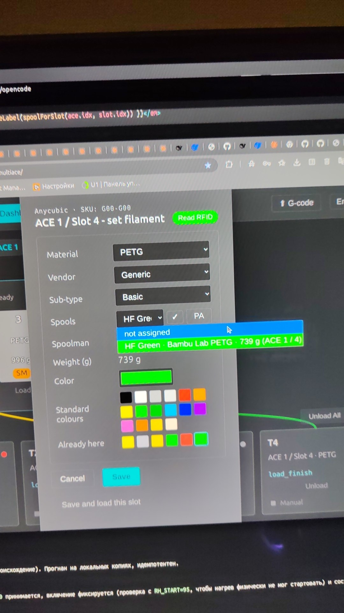

# ACE Pro (gen 1) — reading third-party NFC tags and exposing the UID

Research + working artifacts for making an **Anycubic ACE Pro (1st generation, stock FW `V1.3.863`)**
read **third-party** filament tags (NTAG / OpenSpool / Bambu / Creality / …) and hand their contents to
the printer, to the **multiACE** Klipper module and to the printer screen — no external reader, no
hardware modifications.

* 🇷🇺 **[README-RU.md](README-RU.md)** — the same story in Russian, with the full flash procedure.
* 🇬🇧 **[REPORT-EN.md](REPORT-EN.md)** — full technical report (route analysis, disassembly contracts,
  reproductions, appendices).

## On a live printer

The picker of the **multiACE** web panel showing a tag read on a Gen-1 ACE Pro:
`Read RFID`, SKU `G00-G00` taken from the tag itself.

## Working route

Base = public community firmware (**OpenCubic** / Simon-CR). Our fork adds:

* a single 4-byte hook at `VA 0x08016B9A` → `bl 0x08023C38`,
* a 108-byte position-independent stub appended to the end of the image (code + `0123456789ABCDEF`
  table + a literal pointing at the UID buffer `0x20006224`).

The stub writes `rfid = 2`, magic `0x007B`, version `0x0065` and 14 hex chars of the raw UID into the
slot record, so the CFW's own parsers decode third-party tags and the spool shows up with colour/type.
Device reports firmware `CV1.3.863` (leading `C` = community build) instead of stock `V1.3.863`.

## Stack

| Layer | What is used |
|---|---|
| Device | Anycubic ACE Pro (Gen 1): GD32F303 (Arm Cortex-M4) running the stock FreeRTOS-based firmware `V1.3.863`; MFRC522-class reader reachable only through the firmware's own primitives (`read_reg` `0x08019D12`, `write_reg` `0x08019E1C`, tag ID `0x0800A6A0`); per-slot records of 164 B at `0x20006518` |
| Firmware work | Arm Thumb-2 assembly (`arm-none-eabi-as` / `ld` / `objcopy`, `-mcpu=cortex-m4 -mthumb`), byte-level patching in Python 3 (`struct`, `hashlib`), md5 + CRC-16/MCRF4XX verification, position-independent stub (no absolute branches) |
| Flashing | `ace_flash.py` — Python 3 + pyserial, implementing the ACE IAP wire frame (`FF AA | len(u16 LE) | payload | crc16 | FE`, 64-byte chunks, staging base `0x08024000`), run over the printer's serial port |
| Printer side | Klipper / Moonraker HTTP API (`POST /server/files/upload`, `printer/objects/query`), stock `ACE_EXT_*` G-code commands used for the drying-stop / FW-release / FW-resume sequence |
| Host integration | multiACE Klipper module (`klippy/extras/ace.py`) and the printer screen — both consume the decoded tag from the slot record |
| Verification | md5 / crc16 sums, disassembly, and live checks via `ACE_EXT_RAW METHOD=get_filament_info` |

## Files

| File | What it is | md5 | Size |
|---|---|---|---|
| `ACE_V1.3.863_cfw_uid.bin` | **working image**: community firmware (CFW) + our UID stub | `6148cfc52431fc235536c6d64b5334ef` | 113828 |
| `ACE_V1.3.863_20260716.bin` | base — public CFW (unmodified, for rebuilds) | `9f7b9a678a96caf98d6a08842d3ff971` | 113720 |
| `ACE_V1.3.863_tunnel5.bin` | earlier variant on **stock** FW (register tunnel) | `402b4b23c420b6cbd72b89dac70a2286` | 105652 |
| `ACE_V1.3.863_stock.bin` | clean stock (rollback) | `dcd04589dcadd5b4feab66d33e772531` | 105652 |
| `ace_flash.py` | flasher (run **on the printer**) | — | — |
| `artefacts_stub4.s`, `artefacts_stub_tunnel5.s`, `artefacts_build_tunnel5.py` | stub sources and builder | — | — |

Additional routes, measurements, host-side (multiACE `klippy/extras/ace.py`) changes and hard-won
constraints (one antenna per slot pair `1&3` / `2&4`, no slot separation by driver, unreadable
"neighbour" tag filtering) are described in the report.

## Credits

Community firmware authors (**OpenCubic** / Simon-CR) and the **multiACE** project — this work is built
on theirs and given back to the community.

## Disclaimer

Firmware images are provided **as-is, for research and interoperability purposes**. Flashing is at your
own risk; a failed flash may brick the device. `ACE_V1.3.863_stock.bin` is the original vendor image and
is included only as a rollback reference — all rights belong to Anycubic.

## Licence

Our own files here (documentation, flasher, stub sources, patch recipe) are
**GPL-3.0** — full text in `LICENSE`. The **firmware images are third-party material**
and are *not* covered by that grant: the community firmware comes from OpenCubic
(which publishes no licence file) and the clean image is Anycubic's vendor firmware
(see `NOTICE.md`).
